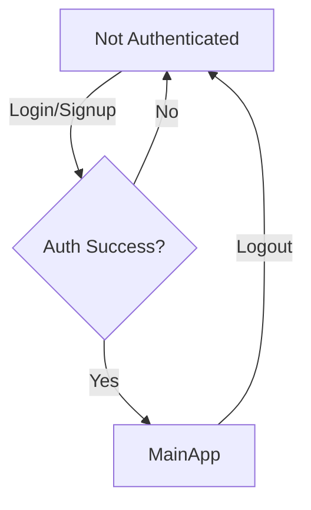
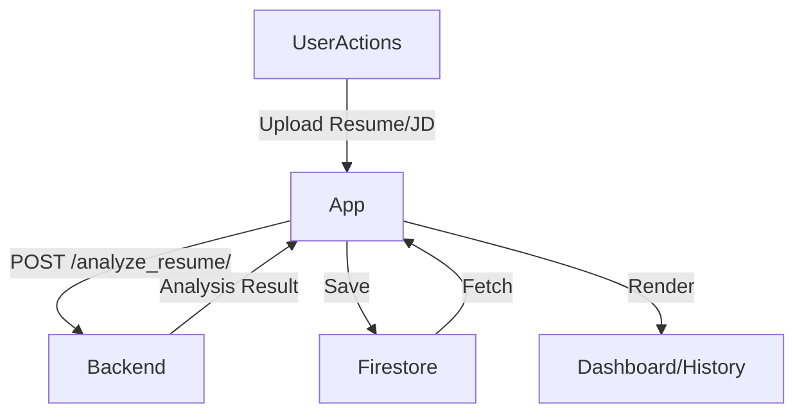
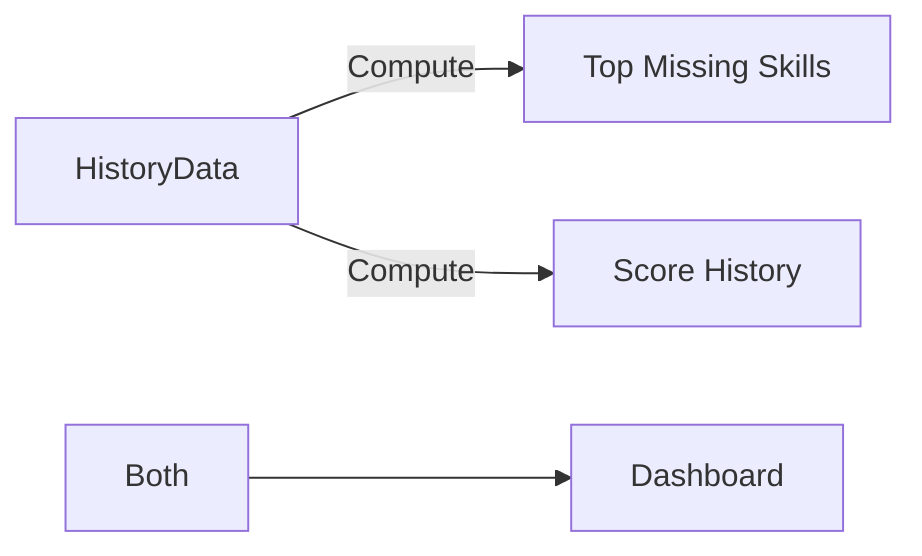
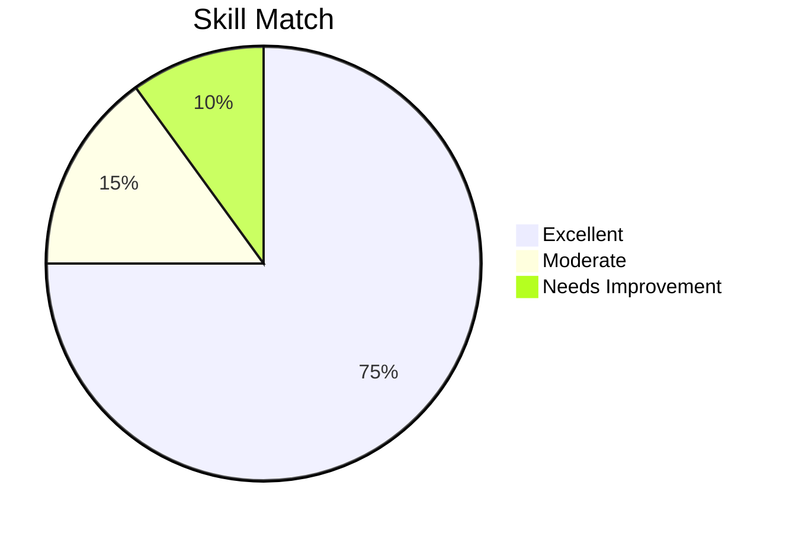
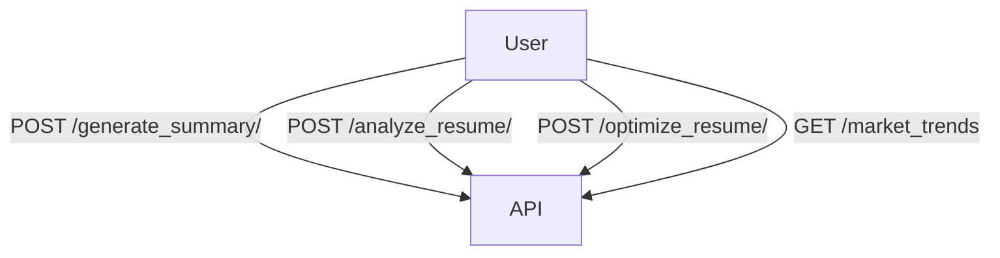
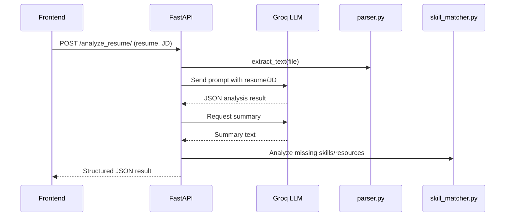

# 📄 App.jsx

This is the main entry point of the React frontend for the Resumifyy application. It orchestrates authentication, state management, theming, navigation, API integration, and communication with Firebase. The UI is dynamically rendered depending on the user's authentication status and selected tab.

---

## Main Responsibilities

- **User Authentication**: Handles login, signup, logout, and password reset using Firebase Auth.
- **State Management**: Manages UI states, form data, theme mode, and tab navigation.
- **Sidebar & Navigation**: Implements a responsive sidebar with support for collapsible/expandable behavior.
- **Resume Analysis**: Sends uploaded resumes and job descriptions to the backend API for analysis.
- **History Management**: Saves and fetches analysis results from Firestore, including filtering, searching, and sorting.
- **PDF Generation**: Allows users to download a thematically styled PDF report of their analysis.
- **User Feedback**: Submits feedback to Firestore.
- **Settings**: Customizes appearance, default tab, and UI preferences.

---

## Key Functionalities

- **normalizeAnalysis**: Cleans and standardizes analysis results.
- **Firebase Integration**: Reads/writes user and history data to Firestore.
- **UI/UX**: Utilizes Material-UI and Framer Motion for a modern, animated interface.
- **API Interactions**: Connects to backend endpoints for resume analysis and optimization.
- **Onboarding**: Guides new users through initial steps with a modal dialog.

---

## Main UI Structure

### Tabs

- **Dashboard**: Shows analytics and trends. (Uses `<Dashboard />`)
- **Analyze**: Form for resume upload and job description entry.
- **History**: View and manage past analyses.
- **Settings**: Configure theme, preferences, and account details.
- **Feedback**: Submit feature requests, bug reports, and ratings.

---

### Authentication Flow



---

### API Communication

- **/analyze_resume/**: Sends resume and job description for analysis.
- **/market_trends**: Fetches global skills trends.
- **/optimize_resume/**: Requests AI-powered resume text improvement.

---

#### Example: Analyze Resume API Call

```js
const formData = new FormData();
formData.append("file", file);
formData.append("job_description", jobDesc);
await axios.post(`${apiUrl}/analyze_resume/`, formData, {
    headers: { "Content-Type": "multipart/form-data" },
});
```

---

### Theming

- **Dark Mode** (default)
- **Light Mode**
- **Sepia Mode** (for eye comfort)
- Theme preference is stored in `localStorage`.

---

### History Filtering & Sorting

- Filter by skill match score (Excellent, Moderate, Needs Improvement)
- Search by filename or job description
- Sort by date or score

---

### Feedback Collection

- Rate experience, submit suggestions/bugs
- Data is stored in `feedback` collection in Firestore

---

```card
{
    "title": "Best Practices",
    "content": "Always ensure the user is authenticated before allowing resume analysis or cloud data access."
}
```

---

## 🔥 Notable Code Features

- **Centralized Firestore Saving**: Clean separation for saving analysis results.
- **Resizable Sidebar**: Adaptive to screen size and user preference.
- **Guided Onboarding**: Modal shown to new users with step-by-step app usage guide.
- **Dynamic PDF Generation**: Theming support for dark/light PDFs.

---

## Data Flow Overview



---

# 📊 Dashboard.jsx

This component serves as the user's analytics dashboard, visualizing personal resume analysis stats and current global skill demand.

---

## Main Responsibilities

- **Personal Analytics**
  - Displays the user's top missing skills (Pie Chart)
  - Shows match score history (Bar Chart)
- **Global Trends**
  - Fetches and displays top 10 global in-demand skills using the `/market_trends` API.
- **Adaptive UI**
  - Dark mode and color accessibility support

---

## Key Functionalities

- **ChartJS Integration**: Renders pie and bar charts with custom theming.
- **Market Trends Fetching**: Calls backend for latest global skills trends, with caching.
- **Leaderboard**: Visualizes global trend ranking with color-coded styles.

---

### Personal Analytics Visualization



---

## API Call Example

```js
const response = await axios.get(`${apiUrl}/market_trends`);
setTopSkills(response.data.top_skills || []);
```

---

### Empty State

If there's no user history, the dashboard defaults to only showing global skill trends.

---

# 📝 ResultCard.jsx

Displays the results of a resume analysis in a user-friendly, actionable format.

---

## Main Responsibilities

- **Skill Match Visualization**: Circular progress bar with level color coding (Excellent, Moderate, Needs Improvement)
- **Summary**: AI-generated summary paragraph
- **Strengths/Weaknesses**: Lists of detected strengths and weaknesses
- **Missing Skills & Learning Resources**: For each missing skill, shows links to YouTube, Coursera, and Udemy resources
- **Improvement Suggestions**: Actionable recommendations
- **AI-Optimize**: Lets users request AI-powered improvements for their resume with a single click, rendered via a modal dialog

---

### Skill Match Visualization



---

## API Integration

- **/optimize_resume/**: Optimizes the resume text according to the job description and missing skills.

---

```card
{
    "title": "Resume Optimization",
    "content": "Use the 'AI-Optimize My Resume' button to receive instant, AI-powered resume improvements tailored to your target job."
}
```

---

# summary.js

A simple API utility for generating a summary of a resume by sending a file to the backend.

---

## Main Responsibility

- **API Helper**: Sends a file to `/generate_summary/` endpoint and returns the summary string.

---

### Usage

```js
const summary = await generateSummary(file);
```

---

### API Block

```api
{
    "title": "Generate Resume Summary",
    "description": "Uploads a resume file and returns a concise, AI-generated summary paragraph.",
    "method": "POST",
    "baseUrl": "http://127.0.0.1:8000",
    "endpoint": "/generate_summary/",
    "headers": [
        { "key": "Content-Type", "value": "multipart/form-data", "required": true }
    ],
    "queryParams": [],
    "pathParams": [],
    "bodyType": "form",
    "formData": [
        { "key": "file", "value": "The resume file (PDF or DOCX)", "required": true }
    ],
    "requestBody": "",
    "responses": {
        "200": {
            "description": "Success",
            "body": "{ \"summary\": \"...\" }"
        },
        "400": {
            "description": "Bad Request",
            "body": "{ \"detail\": \"File parsing error: ...\" }"
        }
    }
}
```

---

# 🎨 App.css

Defines the visual identity and accessibility styles for the Resumifyy frontend.

---

## Main Responsibilities

- **Theming**: Implements dark, light, and sepia color schemes for the app and sidebar.
- **Component Styling**: Customizes sidebar, cards, buttons, charts, and forms for a cohesive appearance.
- **Responsive Enhancements**: Ensures UI adapts to screen size and drawer state.
- **Accessibility**: High-contrast text, clear focus states, and color adjustments for all modes.

---

## Highlights

- **CSS Variables**: Used for easy customization and switching between modes.
- **Sidebar**: Supports mini/collapsed and expanded states with smooth transitions.
- **Charts**: Ensures charts are centered and maintain visual clarity.

---

# 🚀 main.py

The FastAPI backend powering the core features of Resumifyy.

---

## Main Responsibilities

- **Resume Analysis**: Accepts uploads, extracts text, analyzes skills, and returns AI-generated insights.
- **Summary Generation**: Produces a concise summary from a resume file.
- **Market Trends**: Provides up-to-date, globally relevant skill demand data, with Firestore caching.
- **Resume Optimization**: Receives resume text, job description, and missing skills, and returns improved text.
- **CORS Support**: Securely handles cross-origin requests for frontend communication.
- **Firebase Integration**: Caches global trends using Firestore.

---

## Endpoint Overview



---

## API Blocks

### 1. Root

```api
{
    "title": "API Root",
    "description": "Simple healthcheck endpoint.",
    "method": "GET",
    "baseUrl": "http://127.0.0.1:8000",
    "endpoint": "/",
    "headers": [],
    "queryParams": [],
    "pathParams": [],
    "bodyType": "none",
    "requestBody": "",
    "responses": {
        "200": {
            "description": "API is running",
            "body": "{ \"message\": \"Resume Analyzer API (Groq Llama 3.1)\" }"
        }
    }
}
```

---

### 2. Generate Summary

```api
{
    "title": "Generate Resume Summary",
    "description": "Uploads a resume file and returns a summary.",
    "method": "POST",
    "baseUrl": "http://127.0.0.1:8000",
    "endpoint": "/generate_summary/",
    "headers": [
        { "key": "Content-Type", "value": "multipart/form-data", "required": true }
    ],
    "queryParams": [],
    "pathParams": [],
    "bodyType": "form",
    "formData": [
        { "key": "file", "value": "Resume file (PDF/DOCX)", "required": true }
    ],
    "requestBody": "",
    "responses": {
        "200": {
            "description": "Success",
            "body": "{ \"summary\": \"...\" }"
        }
    }
}
```

---

### 3. Analyze Resume

```api
{
    "title": "Analyze Resume",
    "description": "Uploads resume and job description. Returns skill match, missing skills, strengths, weaknesses, suggestions, summary, and resume text.",
    "method": "POST",
    "baseUrl": "http://127.0.0.1:8000",
    "endpoint": "/analyze_resume/",
    "headers": [
        { "key": "Content-Type", "value": "multipart/form-data", "required": true }
    ],
    "bodyType": "form",
    "formData": [
        { "key": "file", "value": "Resume file (PDF/DOCX)", "required": true },
        { "key": "job_description", "value": "Job description text", "required": true }
    ],
    "requestBody": "",
    "responses": {
        "200": {
            "description": "Success",
            "body": "{ \"skill_match\": 88, \"missing_skills\": [...], \"strengths\": [...], \"weaknesses\": [...], \"suggestions\": [...], \"learning_resources\": {...}, \"summary\": \"...\", \"resume_text\": \"...\", \"raw_ai\": {...} }"
        },
        "400": {
            "description": "File parsing error",
            "body": "{ \"detail\": \"File parsing error: ...\" }"
        }
    }
}
```

---

### 4. Market Trends

```api
{
    "title": "Global Market Trends",
    "description": "Returns a list of top 10 in-demand skills for software/data science roles worldwide, with Firestore caching.",
    "method": "GET",
    "baseUrl": "http://127.0.0.1:8000",
    "endpoint": "/market_trends",
    "headers": [],
    "bodyType": "none",
    "responses": {
        "200": {
            "description": "Success",
            "body": "{ \"top_skills\": [ { \"skill\": \"Python\", \"rank\": 1 }, ... ] }"
        }
    }
}
```

---

### 5. Optimize Resume

```api
{
    "title": "Optimize Resume",
    "description": "Improves resume text based on job description and missing skills.",
    "method": "POST",
    "baseUrl": "http://127.0.0.1:8000",
    "endpoint": "/optimize_resume/",
    "headers": [
        { "key": "Content-Type", "value": "application/x-www-form-urlencoded", "required": true }
    ],
    "bodyType": "form",
    "formData": [
        { "key": "resume_text", "value": "Extracted resume text", "required": true },
        { "key": "job_description", "value": "Job description text", "required": true },
        { "key": "missing_skills", "value": "Comma-separated missing skills", "required": true }
    ],
    "requestBody": "",
    "responses": {
        "200": {
            "description": "Success",
            "body": "{ \"optimized_text\": \"...\" }"
        },
        "500": {
            "description": "Server error",
            "body": "{ \"detail\": \"...\" }"
        }
    }
}
```

---

```card
{
    "title": "API Security",
    "content": "Always validate file types and sanitize inputs when handling uploads."
}
```

---

# schemas.py

This file is **empty** and does not define any schemas or models. Likely a placeholder for future Pydantic schema definitions.

---

# parser.py

Responsible for extracting plain text from uploaded resume files, supporting PDF and DOCX formats.

---

## Main Responsibilities

- **PDF Extraction**: Uses `pdfplumber` to read and combine all text from each PDF page.
- **DOCX Extraction**: Uses `python-docx` to concatenate all paragraph text.
- **Error Handling**: Raises an error if the file format is unsupported.

---

### Logic

```python
def extract_text(file_path: str) -> str:
    text = ""
    ext = os.path.splitext(file_path)[1].lower()
    if ext == ".pdf":
        with pdfplumber.open(file_path) as pdf:
            for page in pdf.pages:
                text += page.extract_text() or ""
    elif ext == ".docx":
        doc = Document(file_path)
        text = "\n".join([p.text for p in doc.paragraphs])
    else:
        raise ValueError("Unsupported file format")
    return text.strip()
```

---

# summary.py

Implements summary generation for resumes using the Groq Llama 3.1 model.

---

## Main Responsibilities

- **Prompt Engineering**: Crafts a prompt for a professional recruiter to summarize the candidate's resume.
- **API Integration**: Uses a Groq client to get AI-generated text.
- **Output Cleaning**: Removes unwanted markdown formatting and bullet points.

---

### Logic

- Ensures output is a concise, single-paragraph summary.
- Handles errors gracefully by returning an error message string.

---

# skill_matcher.py

Analyzes the skill gap in the resume and generates learning resource links for missing skills.

---

## Main Responsibilities

- **Missing Skills Normalization**: Cleans and prepares the list of missing skills.
- **Resource Link Generation**: For each missing skill, generates YouTube, Coursera, and Udemy search URLs.
- **Returns**: Both the cleaned missing skills list and a resources dictionary.

---

### Structure

```python
def analyze_skill_gap(ai_result):
    # Normalize and clean 'missing_skills'
    # For each skill, generate resource links
    return { "missing_skills": cleaned, "learning_resources": learning_resources }
```

---

# analyzer.py

Performs the core AI-powered analysis of a resume against a job description.

---

## Main Responsibilities

- **Skill Extraction**: Extracts technical skills and languages from both resume and job description.
- **Prompt Engineering**: Sends a structured prompt to Groq Llama 3.1 to analyze resume fit.
- **AI Response Handling**: Ensures strict JSON output, parses and normalizes results.
- **Failsafes**: Guarantees at least one weakness and one suggestion are included in the result.

---

## Output Structure

```json
{
  "skill_match_pct": 88,
  "summary": "...",
  "strengths": ["..."],
  "missing_skills": ["..."],
  "weaknesses": ["..."],
  "suggestions": ["..."]
}
```

---

## Sequence: Resume Analysis



---
```

```
